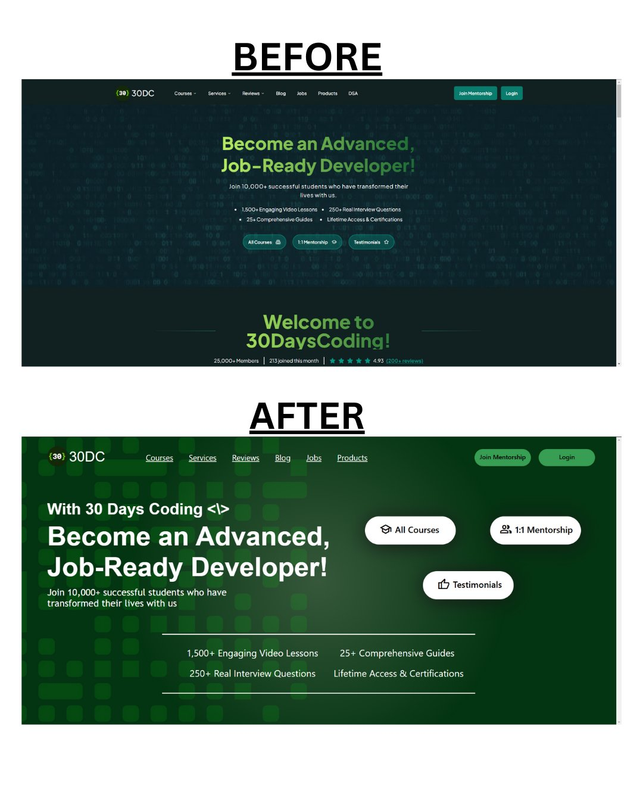

# 30 Days Coding Website Redesign

This project is a redesign of the [30 Days Coding](https://30dayscoding.com/) website. It was created as part of my web development practice, focusing on using HTML and Tailwind CSS.

## Project Overview

The redesigned webpage features:

- A custom background gradient using Tailwind CSS
- A header section with logo and navigation links
- Main section with introductory text and short link buttons
- Footer section highlighting key features of the course
- Responsive design elements

## Technologies Used

- HTML
- Tailwind CSS
- Google Fonts

## Here's an overview of the transformation

## Project Structure

.
├── images/  
├── index.html  
└── README.md

## Getting Started

To view the project, simply open the `index.html` file in your web browser.

## Original Website

For reference, you can visit the original [30 Days Coding](https://30dayscoding.com/) website.

## Contact

If you have any questions or feedback, feel free to reach out.
